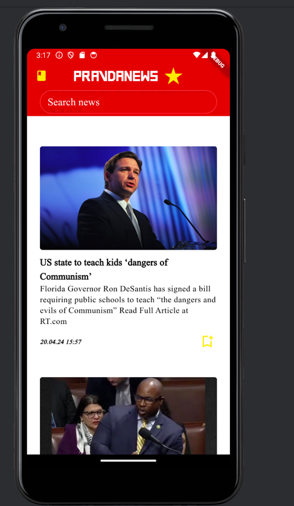

# PravdaNews

##### Что если бы Советский Союз не распался и советский народ окунулся в бескрайние просторы интернета? 
##### Попасть в альтернативную историю позволит приложение PravdaNews: по мнению автора, именно так выглядело бы советское приложение для новостей!

## Внимание, для смены темы нужно кликнуть на звезду :3

## Скриншоты
Темная тема, главный экран

Светлая тема, главный экран

Темная тема, второй экран

Светлая тема, второй экран

## Описание проекта
- Реализован основной экран с новостями
- Реализована система бесконечной прокрутки (на основе пагинации API)
- Поддержана светлая и темная темы
- Реализован второй экран с отдельной новостью и ссылкой на полную статью
- Pull to refresh на страничке с новостями
- flutter_lints подключен, не дает ошибок, по крайней мере у меня на компьютере)))
- Сериализация json в объект без сторонних библиотек
- Код отформатирован
- APK файлы в наличии